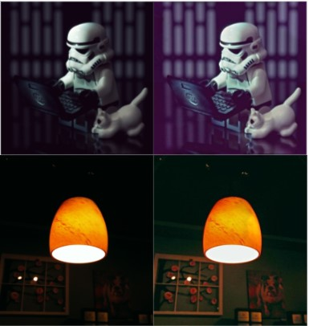

# LIME

__If the program executable doesnt work, please run the individual jupyter notebook files.__

LIME: Low-light Image Enhancement via Illumination Map Estimation
This is a python implementation of the paper - http://www.dabi.temple.edu/~hbling/publication/LIME-tip.pdf

The implementation is done using 2 algorithms.
1. Exact Solver
2. Sped-Up Solver

Note: The test images are taken from https://sites.google.com/view/xjguo/lime  
Sped-Up Solver is implemented using this paper - http://citeseerx.ist.psu.edu/viewdoc/download?doi=10.1.1.385.2768&rep=rep1&type=pdf

More information regarding this project can be found [here](https://docs.google.com/presentation/d/1WdNYG5g0Hr2LcujZCEle31ld-iBHXNQv/edit?usp=sharing&ouid=117754030307866641181&rtpof=true&sd=true).

To run this program, execute code.py and wait for the output images to show up. After the first outputs are displayed, close the output image windows and wait for the next set of outputs. (Note: there are 2 sample outputs in total)

If you face any issues running the python executable, please run the individual python notebooks to go through the algorithms.

# Some Results

Results on some sample inputs from the paper (left-input, right-output).

Results on some custom inputs (left-input, right-output).

**Additional Result:** We observed that this enhancement method when applied on the input image iteratively can help identify hidden structures and patterns from even the darkest of the input images (see below example).

# Libraries Used (in Python3)
 - cv2
 - scipy
 - numpy
 
# Project Members

  - [Saransh Dave](https://www.linkedin.com/in/saransh-dave/)
  - [Aditya Kallappa](https://www.linkedin.com/in/aditya-kallappa/)
